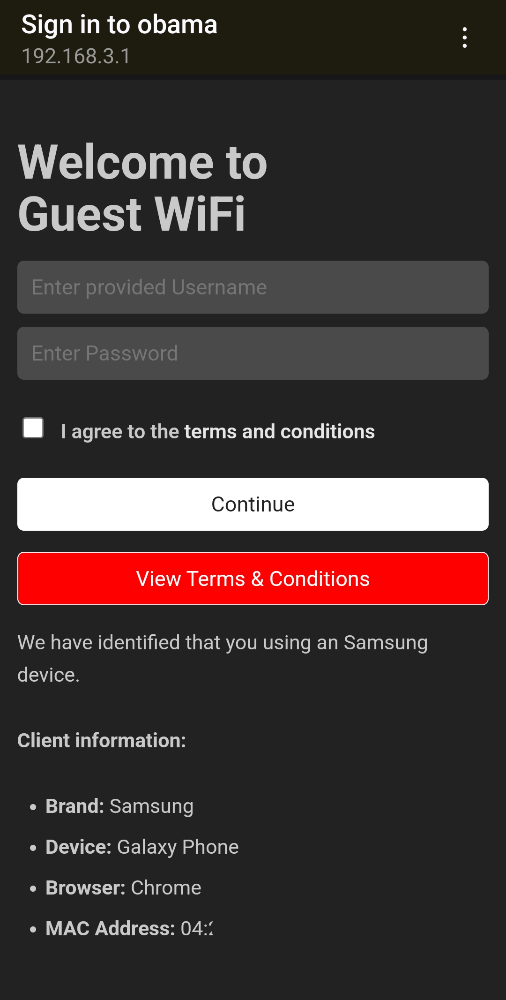

# nodogsplash-mod

Modded version of nodogsplash sample page.
Copied some huge portions of the [original source code](https://github.com/nodogsplash/nodogsplash/tree/master/resources).

Under compliance of GPL version 2.0.



## Features

- Added `jq` as dependency to parse JSON
- HTML5 Web page
- Responsive mobile-first design
- [WIP] Google Firebase (NOSQL) support to download JSON straight from a HTTP client (REST) then parse with `jq`

## OpenWRT Setup

```sh
uci set nodogsplash.@nodogsplash[0].splashpage='splash.html'
uci set nodogsplash.@nodogsplash[0].binauth='/etc/nodogsplash/binauth.sh'
uci commit nodogsplash
```

## Logging

Please read the documentation provided: https://openwrt.org/docs/guide-user/base-system/log.essentials

```sh
# List syslog
logread
 
# Write a message with a tag to syslog
logger -t TAG MESSAGE
 
# List syslog filtered by tag
logread -e TAG
```

## Reminder

Make sure binauth.sh has proper permissions:

```sh
chmod u+x bin/binauth.sh
```
